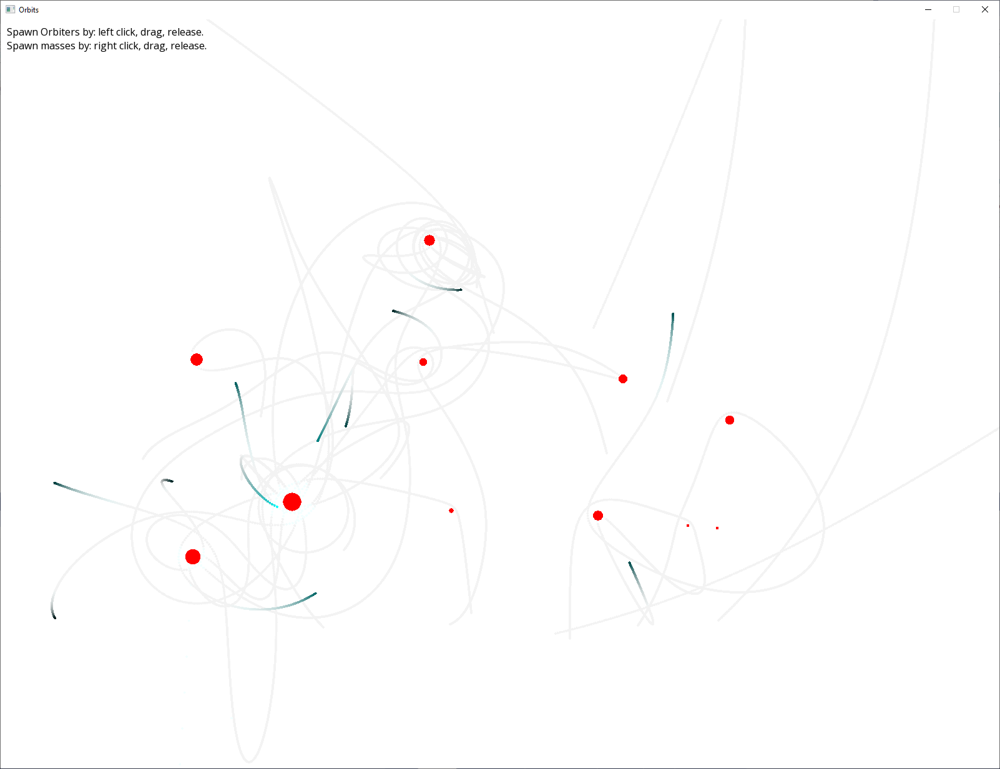

# Orbits

This is a toy application that renders stationary masses and massless objects orbiting those masses. It was created with C# and SFML.Net.

A couple caveats with this application: it "clears" the background by drawing a faint white rect over the window. The purpose of this is to show some trails. This causes light gray to never fully be cleared out. Conservation of energy is broken when the objects get very close to masses. They will get enormous amounts of energy. This is probably due to the naive update function. Speaking of which, every object will update 100 times per frame (in 1/100th increments), so as to minimize artifacts from the naive update algorithm.

